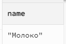
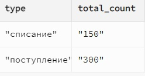

# Руководство по выполнению сложных SQL-запросов в PostgreSQL

В этом руководстве рассмотрим примеры сложных SQL-запросов, которые выполняют объединение данных, использование подзапросов, агрегацию и рекурсию.

*В конце руководства представлен код заполнения таблиц для гарантированного выполнения запросов.*

---

## 1. Соединение двух таблиц с помощью JOIN

Выведем информацию о продуктах и связанных с ними затратах из таблиц `Product` и `ProductCost`.

```sql
SELECT Product.name, ProductCost.cost
FROM Product
JOIN ProductCost ON Product.id = ProductCost.product_id;
```

**Выполнение запроса:**


---

## 2. Соединение двух таблиц с помощью WHERE

Выведем информацию о продуктах и связанных с ними затратах, используя условие в WHERE:

```sql
SELECT Product.name, ProductCost.cost
FROM Product, ProductCost
WHERE Product.id = ProductCost.product_id;
```

**Выполнение запроса:**


---

## 3. Соединение более чем двух таблиц с помощью JOIN

Выведем данные о продуктах, операциях и связанных складах:

```sql
SELECT Product.name, Operation.date, Storage.address
FROM Product
JOIN ProductOperation ON Product.id = ProductOperation.product_id
JOIN Operation ON ProductOperation.operation_id = Operation.id
JOIN Storage ON Operation.storage_id = Storage.id;
```

**Выполнение запроса:**


---

## 4. Соединение более чем двух таблиц с помощью WHERE

Выведем те же данные, используя WHERE:

```sql
SELECT Product.name, Operation.date, Storage.address
FROM Product, ProductOperation, Operation, Storage
WHERE Product.id = ProductOperation.product_id
  AND ProductOperation.operation_id = Operation.id
  AND Operation.storage_id = Storage.id;
```

**Выполнение запроса:**


---

## 5. Использование псевдонимов на примере рекурсивного запроса

Найдем иерархию сотрудников, где менеджеры и подчиненные связаны через поле `manager_id`:

```sql
WITH RECURSIVE EmployeeHierarchy AS (
  SELECT id, fullname, manager_id
  FROM Employee
  WHERE manager_id IS NULL

  UNION ALL

  SELECT e.id, e.fullname, e.manager_id
  FROM Employee e
  JOIN EmployeeHierarchy eh ON e.manager_id = eh.id
)
SELECT * FROM EmployeeHierarchy;
```

**Выполнение запроса:**


---

## 6. Подзапрос, возвращающий единственное значение

Выведем имя продукта с максимальной стоимостью:

```sql
SELECT name
FROM Product
WHERE id = (SELECT product_id FROM ProductCost ORDER BY cost DESC LIMIT 1);
```

**Выполнение запроса:**



---

## 7. Подзапрос, возвращающий множественные значения

Выведем все продукты, которые есть в таблице затрат:

```sql
SELECT name
FROM Product
WHERE id IN (SELECT product_id FROM ProductCost);
```

**Выполнение запроса:**


---

## 8. Агрегатные функции в подзапросе

Выведем продукты, чья стоимость превышает среднюю стоимость всех продуктов:

```sql
SELECT name
FROM Product
WHERE id IN (
  SELECT product_id
  FROM ProductCost
  WHERE cost > (SELECT AVG(cost) FROM ProductCost)
);
```

**Выполнение запроса:**


---

## 9. Использование GROUP BY и HAVING для нескольких источников данных

Выведем склады, на которых хранится больше 100 единиц товаров:

```sql
SELECT Storage.address, SUM(ProductOperation.count) AS total_count
FROM ProductOperation
JOIN Operation ON ProductOperation.operation_id = Operation.id
JOIN Storage ON Operation.storage_id = Storage.id
GROUP BY Storage.address
HAVING SUM(ProductOperation.count) > 100;
```

**Выполнение запроса:**



---

## 10. Подзапрос с вычислением

Выведем продукты с их стоимостью и стоимостью с налогом 20%:

```sql
SELECT name, cost, cost * 1.2 AS cost_with_tax
FROM Product
WHERE id IN (SELECT product_id FROM ProductCost);
```

**Выполнение запроса:**


---

## Заключение

Теперь вы знаете, как выполнять сложные запросы в PostgreSQL. Эти примеры помогут вам анализировать данные из нескольких таблиц, использовать подзапросы и выполнять вычисления для получения нужной информации.
