# Руководство по созданию базы данных в Supabase

В этом руководстве мы рассмотрим шаги по созданию организации и проекта в сервисе Supabase.

## 1. Создание организации

### Шаг 1: Начало создания организации

После того, как был произведён вход в аккаунт и осуществлён переход на [главную страницу с проектами](https://supabase.com/dashboard/projects), для дальнейшей работы нам потребуется создать свою организацию.

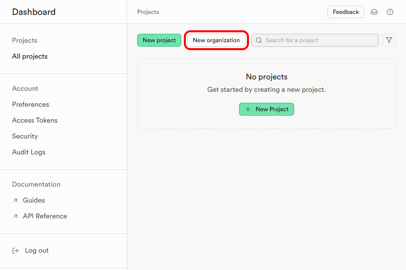

### Шаг 2: Введите имя организации

Введите имя вашей организации в соответствующем поле.

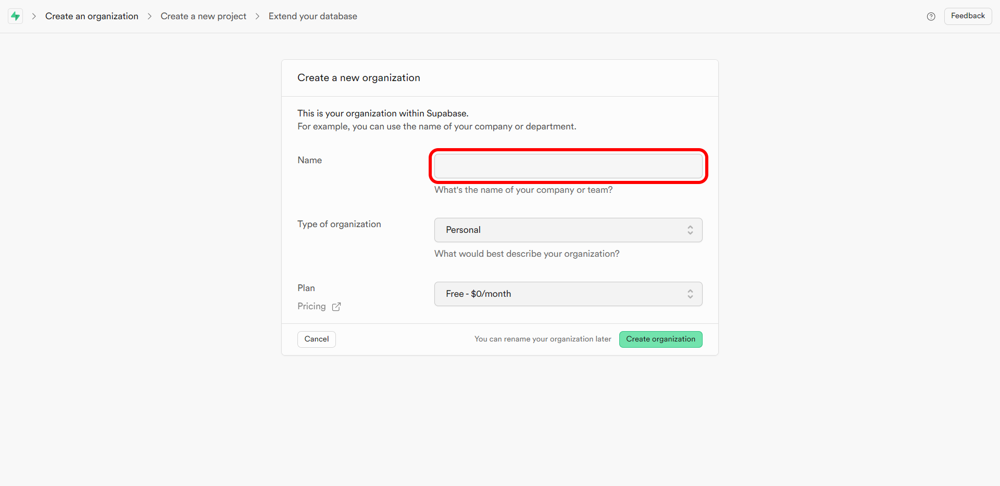

### Шаг 3: Выберите тип организации

Выберите подходящий тип организации из предложенных вариантов:

- Личная
- Образовательная
- Стартап
- Агенство
- Компания
- Не выбрано.

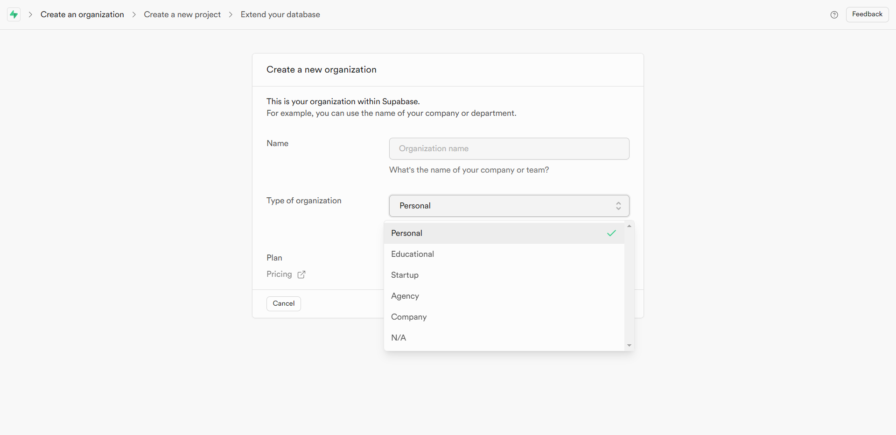

### Шаг 4: Выбор тарифного плана

Выберите нужный тарифный план для вашей организации:

- **Бесплатный ($0/месяц)**
  ***Идеально подходит для увлекательных проектов и простых веб-сайтов.***

- Профессиональный ($25/месяц)
  *Для промышленных приложений с возможностью масштабирования.*

- Командный ($599/месяц)
  *Добавляйте такие функции, как единый вход, контроль над резервными копиями и отраслевые сертификаты.*

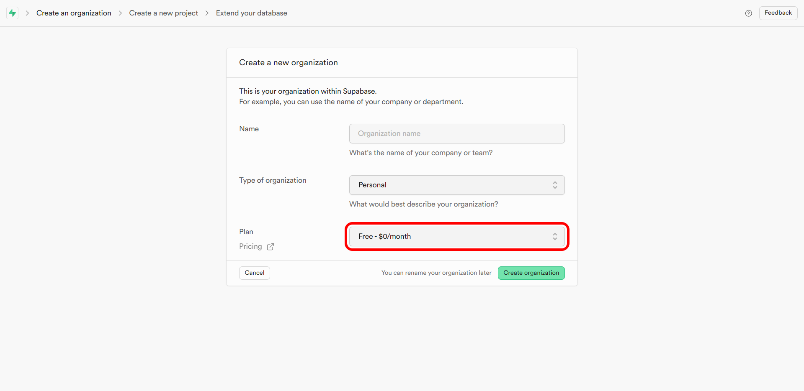

### Шаг 5: Подтверждение данных

После заполнения всех полей, проверьте введённые данные и нажмите кнопку **Create organization** для завершения создания организации.

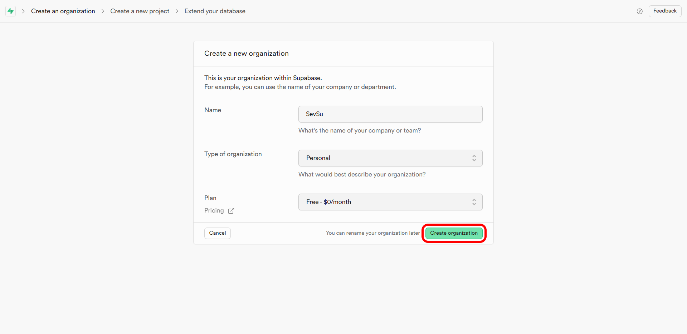

---

## 2. Создание проекта

### Шаг 1: Начало создания проекта

После создания организации можно приступать к созданию нового проекта. Если вы оказались на [главной странице проектов](https://supabase.com/dashboard/projects), то вам необходимо нажать на кнопку **New project**, а затем кликнуть на созданную нами ранее организацию.

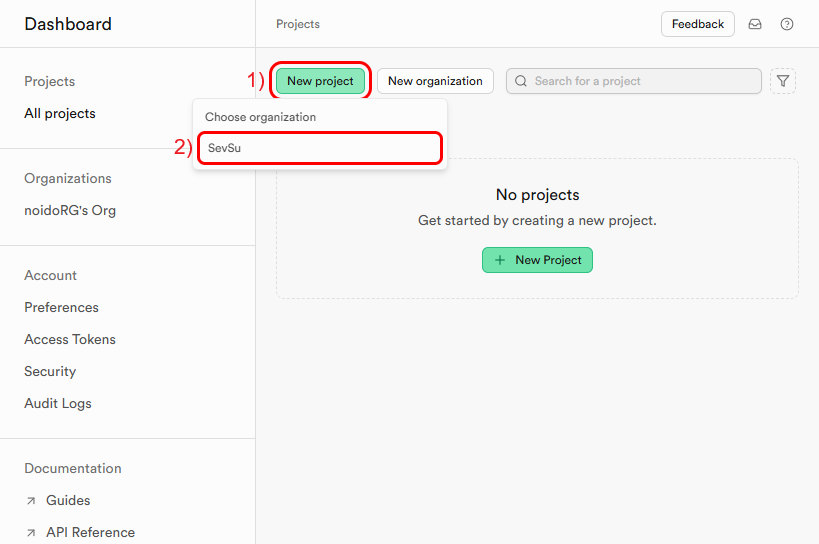

### Шаг 2: Введите имя проекта

Введите имя для вашего проекта.

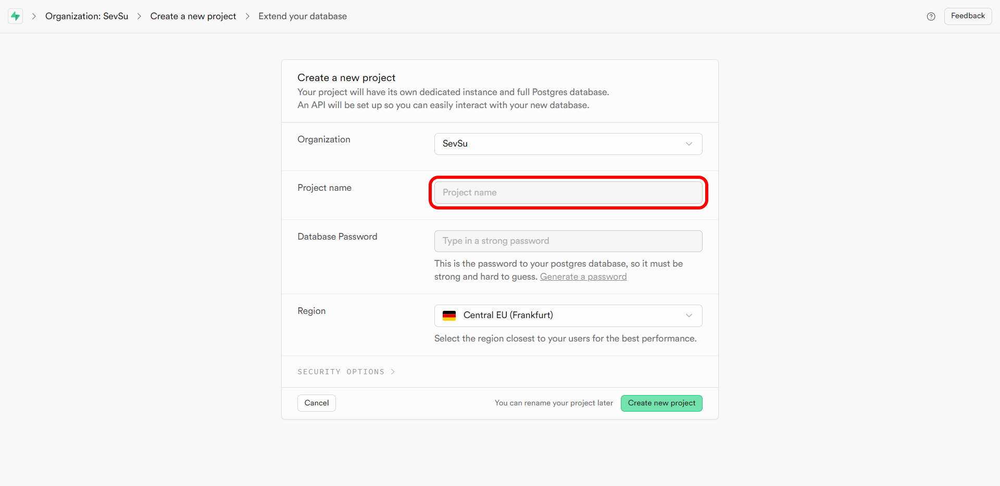

### Шаг 3: Создание пароля

Supabase рекомендует делать пароль сильным и предлагает автоматически сгенеририровать его для вашего проекта. Для этого следует нажать на кнопку **Generate a password**.

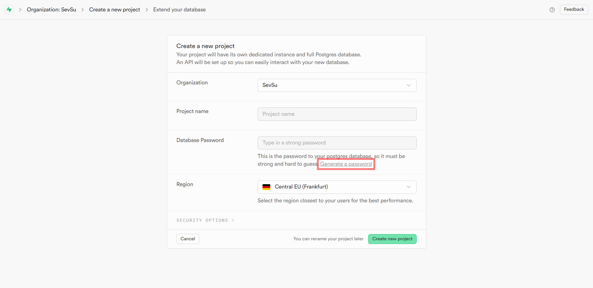  

Чтобы скопировать сгенерированный пароль, необходимо нажать на кнопку **Copy**. Сохраните ваш пароль в надёжном и безопасном и месте.

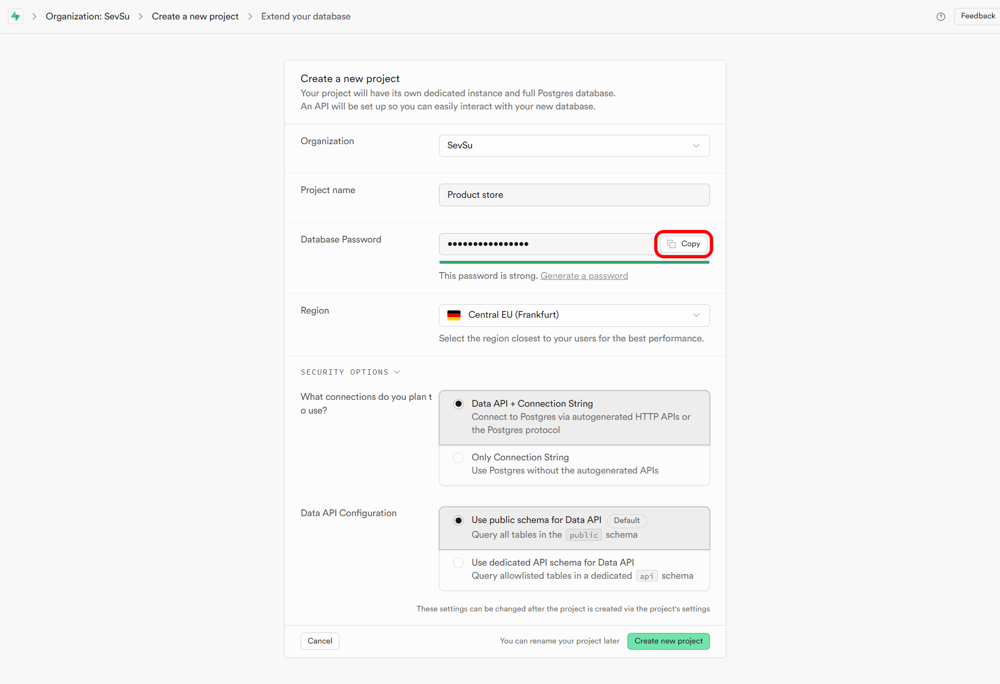

### Шаг 4: Выбор региона для проекта

Выберите регион, в котором будут размещены данные вашего проекта. Рекомендуется выбирать ближайший к вашим пользователям регион.
В нашем случае это Central EU (Frankfurt).
  
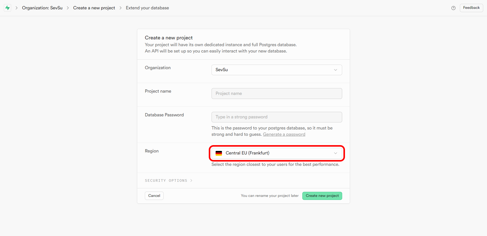  
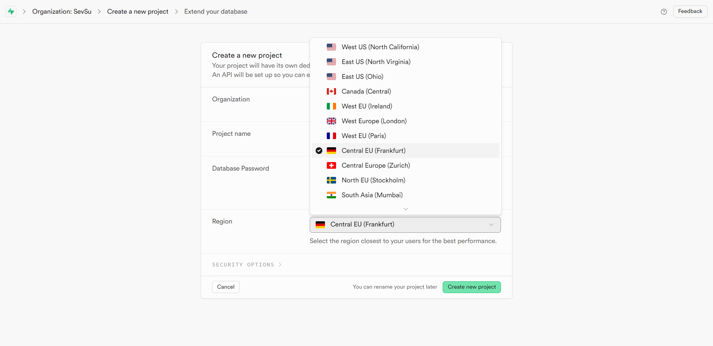

### Шаг 5: Завершение настройки проекта

После заполнения всех необходимых полей, проверьте данные и завершите создание проекта.

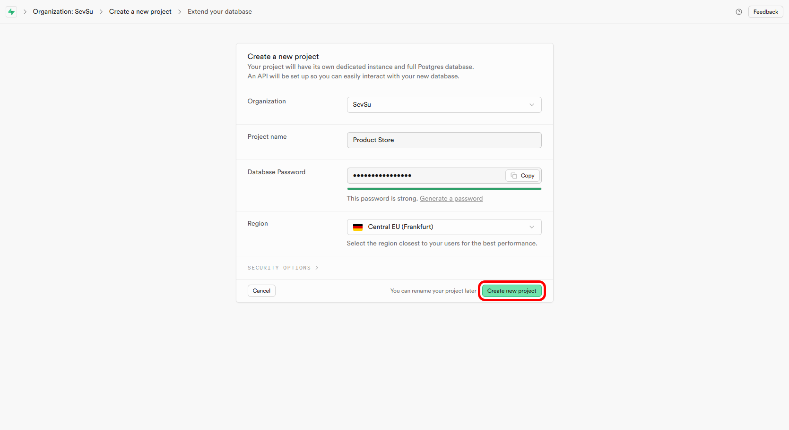

---

## 3. Просмотр созданного проекта

После успешного создания проекта, вы сможете увидеть его на панели управления.

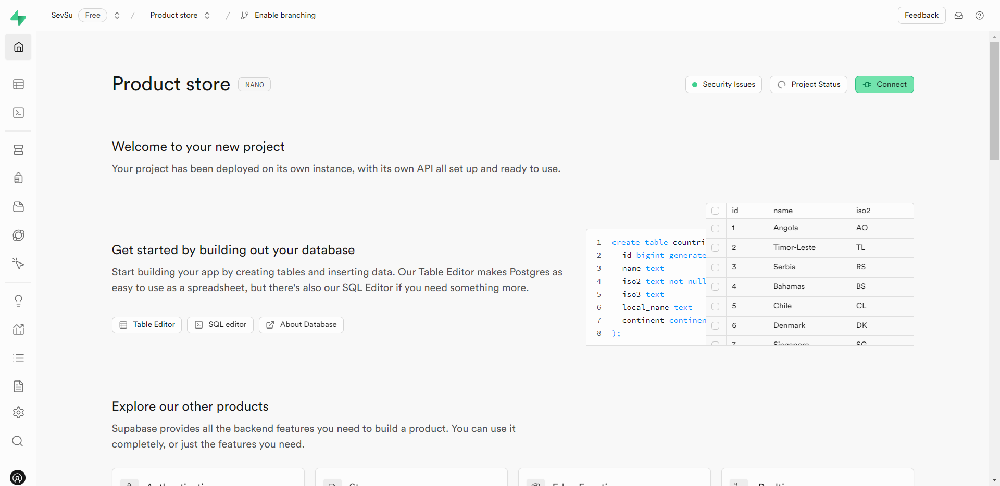

---

Теперь организация и проект успешно созданы и можно начинать работу с базой данных и использовать возможности платформы для разработки приложения.
