```sql
create type measurement_unit as enum (
  'килограммы',
  'штуки',
  'литры',
  'метры'
);
```

---

# Руководство по созданию базы данных в Supabase

В этом руководстве мы рассмотрим шаги по созданию организации и проекта в Supabase, используя предоставленные изображения.

## 1. Создание организации

### Шаг 1: Начало создания организации

Для начала перейдите на главную страницу Supabase и нажмите на кнопку создания организации.

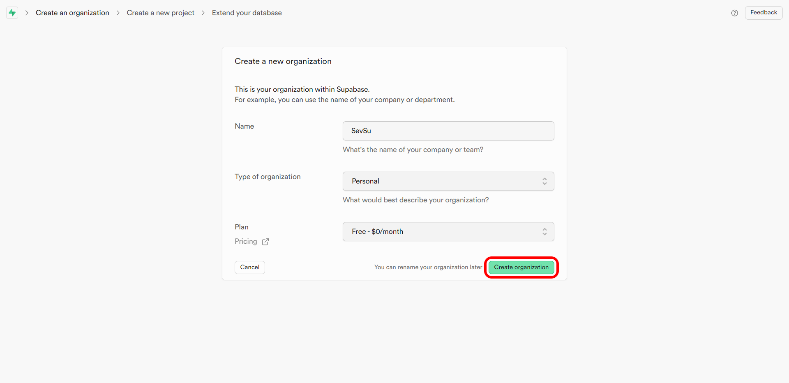

### Шаг 2: Введите имя организации

Введите имя вашей организации в соответствующем поле.

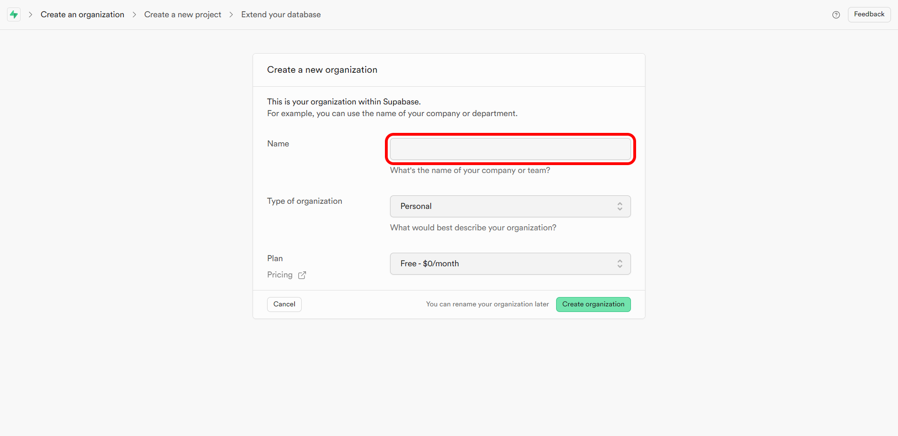

### Шаг 3: Выбор тарифного плана

Выберите тарифный план для вашей организации.

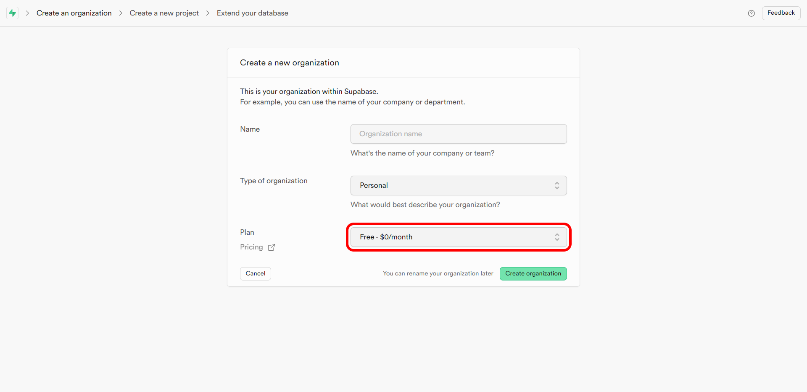

### Шаг 4: Выберите тип организации

Выберите тип организации из предложенных вариантов.

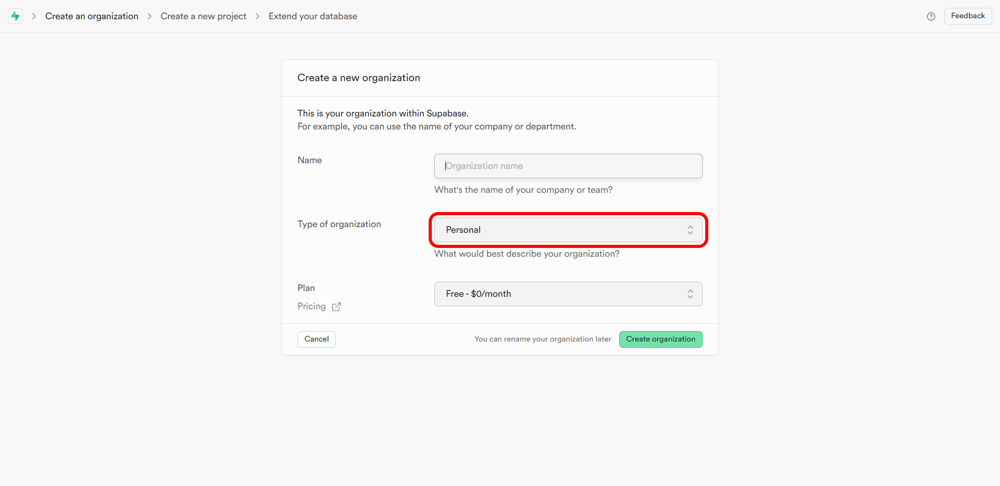  
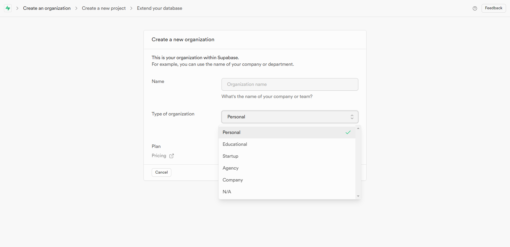

### Шаг 5: Подтверждение данных

После заполнения всех полей, проверьте введённые данные и нажмите кнопку для завершения создания организации.

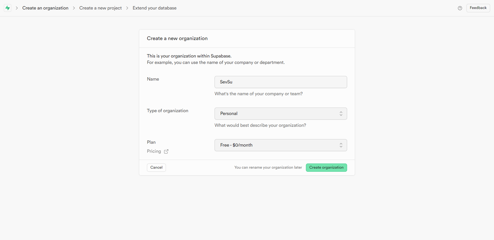

---

## 2. Создание проекта

### Шаг 1: Начало создания проекта

После создания организации можно приступать к созданию нового проекта. Нажмите "Create a new project".

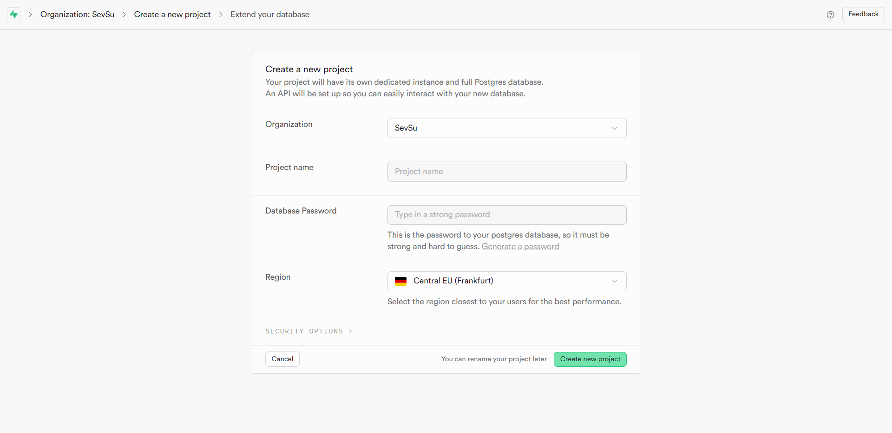

### Шаг 2: Введите имя проекта

Введите имя для вашего проекта.

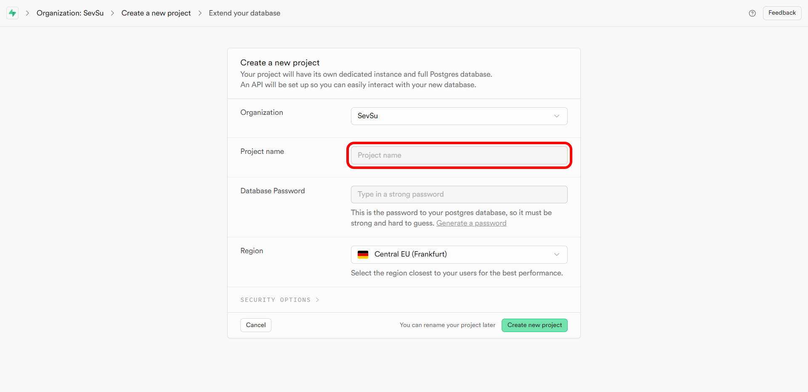

### Шаг 3: Скопируйте сгенерированный пароль

Система автоматически сгенерирует пароль для вашего проекта. Скопируйте его и сохраните в безопасном месте.

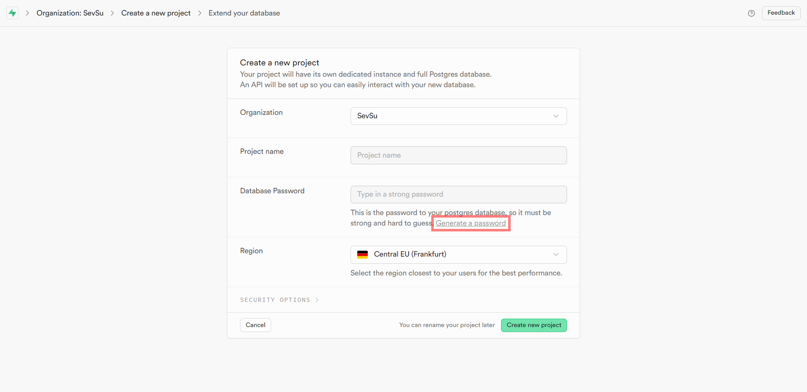  
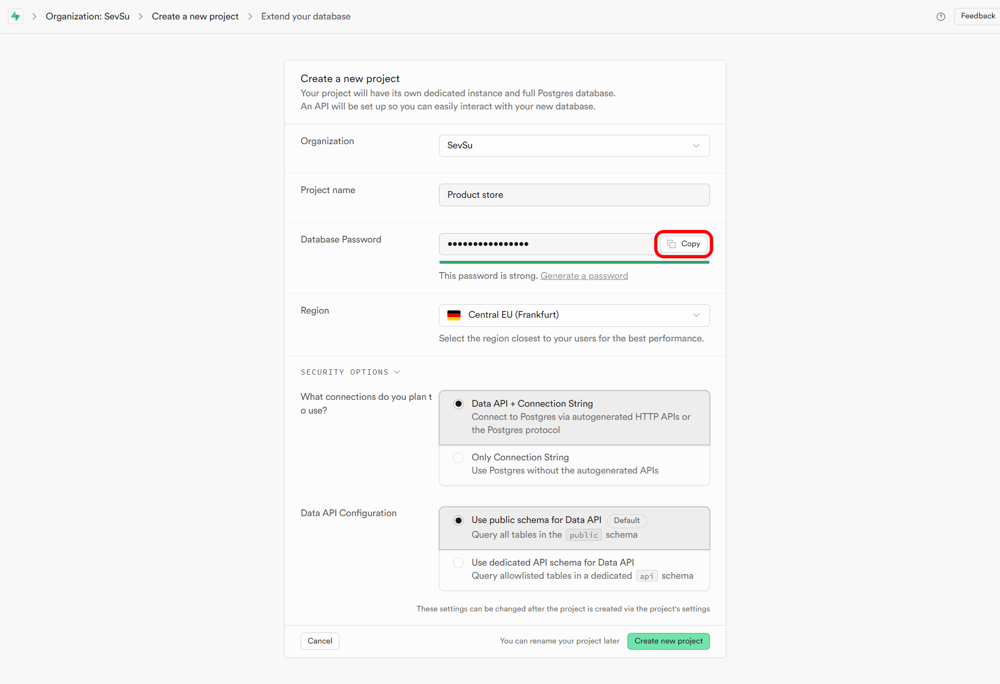

### Шаг 4: Выберите регион для проекта

Выберите регион, в котором будут размещены данные вашего проекта.
  
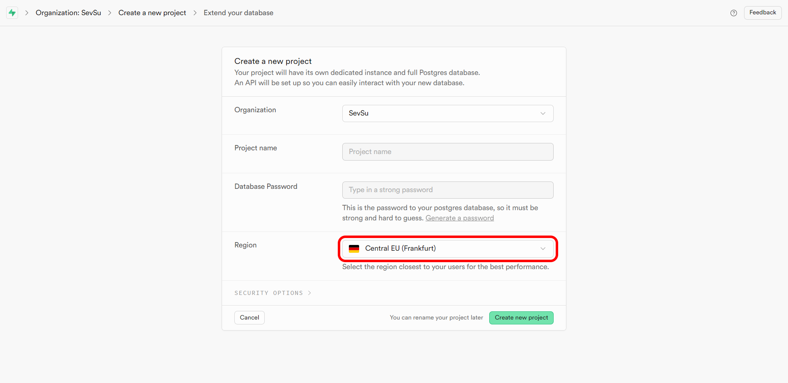  
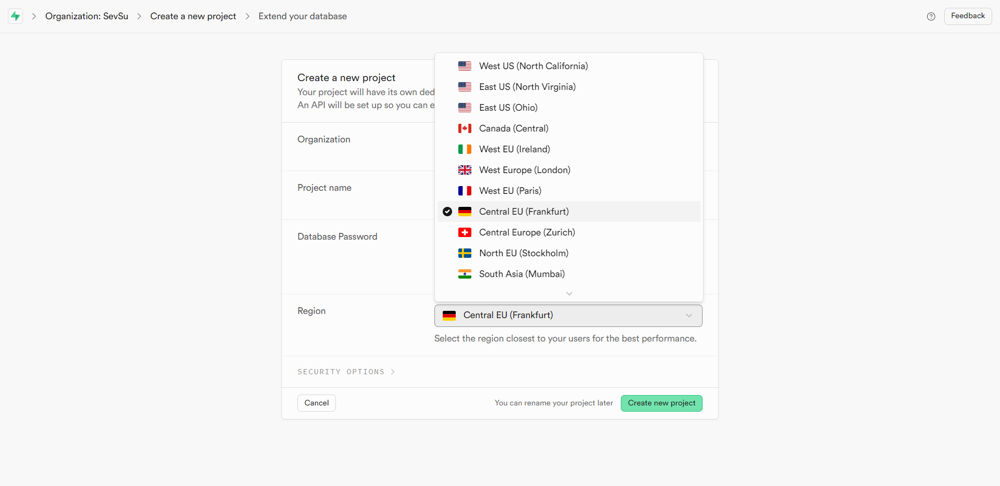

### Шаг 5: Подключение API

Настройте подключение к API, если это требуется.

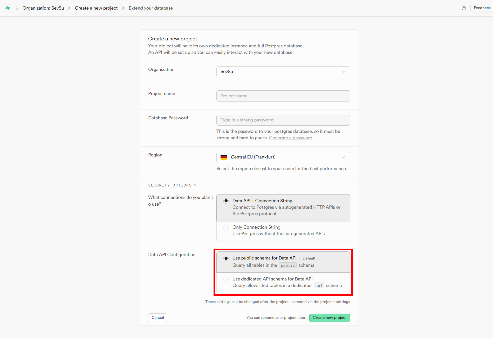

### Шаг 6: Настройка подключения к базе данных

Укажите параметры подключения к базе данных.

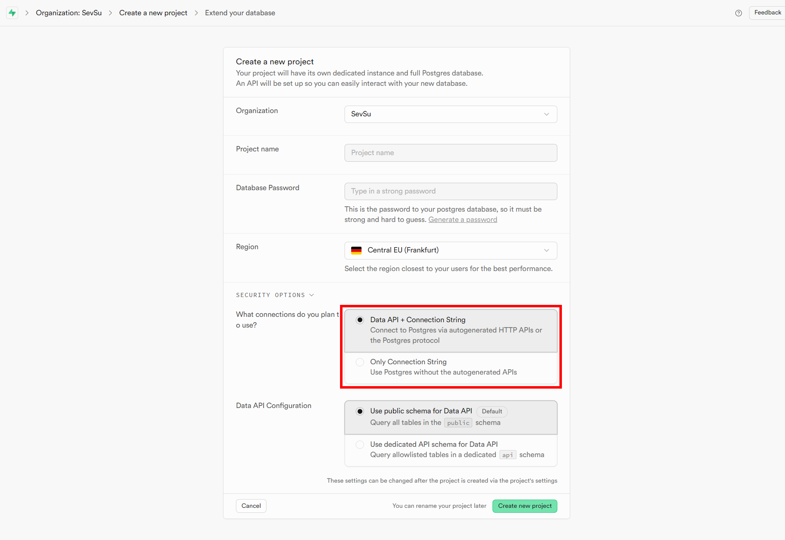

### Шаг 7: Выбор дополнительных параметров безопасности

Настройте дополнительные параметры безопасности для вашего проекта.

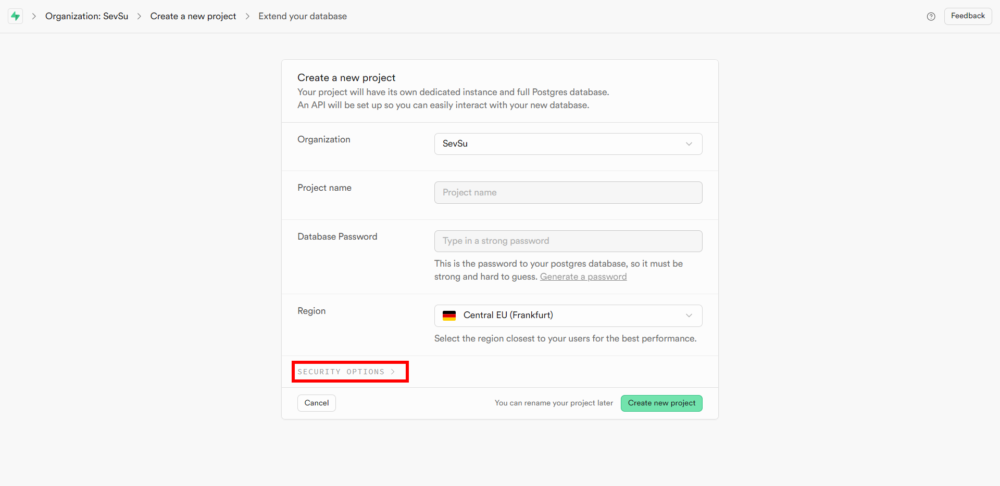
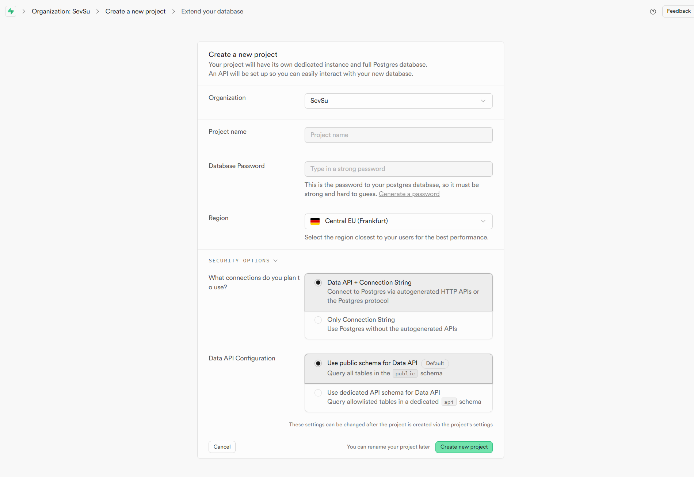  

### Шаг 8: Завершение настройки проекта

После заполнения всех необходимых полей, проверьте данные и завершите создание проекта.

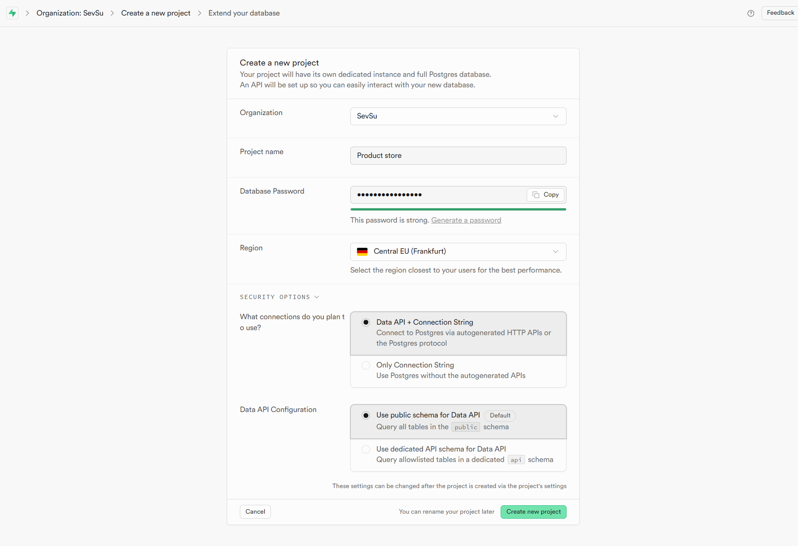

---

## 3. Просмотр созданного проекта

После успешного создания проекта, вы сможете увидеть его на панели управления.


---

Теперь организация и проект успешно созданы и можно начинать работу с базой данных и использовать возможности платформы для разработки приложения.
