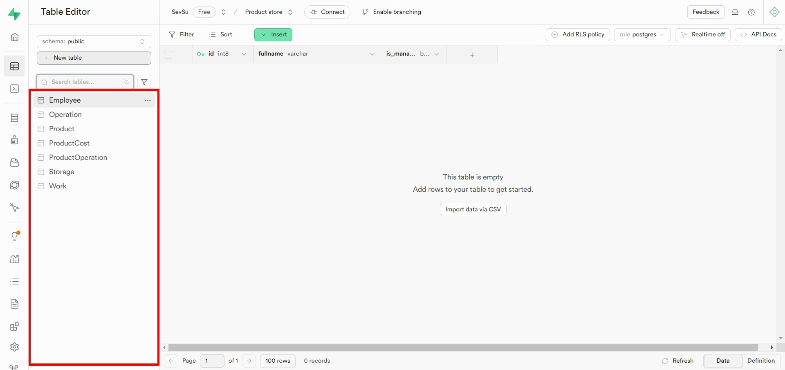
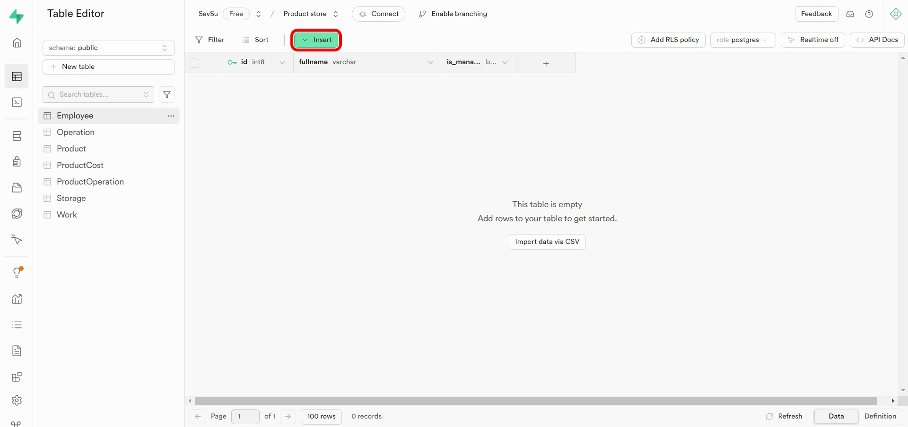
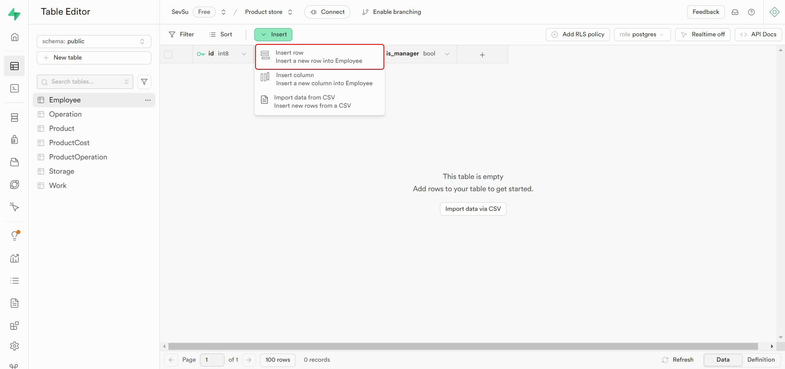
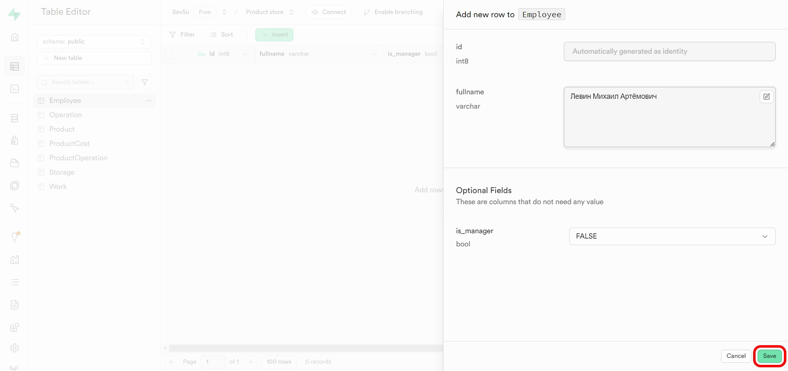
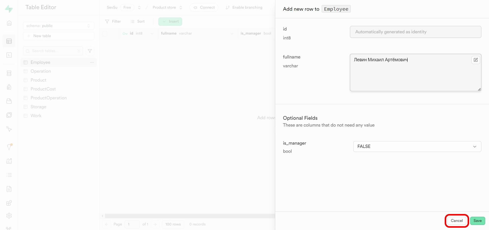

# Руководство по добавлению записей в таблицу (PostgreSQL)

В этом руководстве рассмотрим два способа добавления записей в таблицу в Supabase:

1. С помощью графического интерфейса.
2. С помощью SQL Editor.

---

## 1. Добавление записей с помощью графического интерфейса

### Шаг 1: Открытие Table Editor

Перейдите в проект Supabase и откройте **Table Editor**. Выберите таблицу, в которую хотите добавить запись. Например, выберите таблицу `Employee`.

### Шаг 2: Нажмите на кнопку "Insert"

На панели инструментов найдите кнопку **Insert** и нажмите её. Появится выпадающее меню. Выберите опцию **Insert row**.

### Шаг 3: Заполнение полей

Заполните поля для новой записи. Например:

- **fullname**: Левин Михаил Артёмович.
- **is_manager**: FALSE.

### Шаг 4: Сохранение записи

После заполнения всех необходимых полей нажмите кнопку **Save** для сохранения записи в таблице.

> Если хотите отменить добавление записи, нажмите **Cancel**.

Скриншоты шагов представлены ниже:

1. **Выбор таблицы Employee**:
   

2. **Нажатие на кнопку Insert**:
   

3. **Выбор Insert row**:
   

4. **Заполнение полей записи**:
   

5. **Сохранение записи**:
   

6. **Отмена добавления записи** (если необходимо):
   

---

## 2. Добавление записей с помощью SQL Editor

Для добавления записей с использованием SQL Editor выполните следующие шаги:

### Шаг 1: Открытие SQL Editor

В интерфейсе Supabase выберите **SQL Editor**.

### Шаг 2: Написание SQL-запроса

Напишите SQL-запрос для добавления записи в таблицу. Например, чтобы добавить запись в таблицу `Employee`, выполните следующий запрос:

```sql
INSERT INTO Employee (fullname, is_manager)
VALUES ('Левин Михаил Артёмович', FALSE);
```

### Шаг 3: Выполнение запроса

Нажмите кнопку **Run** для выполнения SQL-запроса.

---

## 3. Заполнение всех таблиц данными

### Примерные данные для всех таблиц

Заполним все таблицы вашей базы данных начальными данными:

#### Таблица `Employee`

```sql
INSERT INTO Employee (fullname, is_manager)
VALUES
  ('Иванов Иван Иванович', TRUE),
  ('Петров Петр Петрович', FALSE),
  ('Сидорова Мария Ивановна', FALSE);
```

#### Таблица `Storage`

```sql
INSERT INTO Storage (number, address, phone)
VALUES
  (1, 'ул. Ленина, д. 1', '123-456-7890'),
  (2, 'ул. Гагарина, д. 5', '987-654-3210');
```

#### Таблица `Product`

```sql
INSERT INTO Product (name, description, measurement_unit)
VALUES
  ('Молоко', 'Молоко 1 литр', 'литры'),
  ('Хлеб', 'Хлеб белый', 'штуки'),
  ('Яблоки', 'Яблоки зеленые', 'килограммы');
```

#### Таблица `ProductCost`

```sql
INSERT INTO ProductCost (date, cost, product_id)
VALUES
  ('2024-01-01', 50.00, 1),
  ('2024-01-02', 20.00, 2),
  ('2024-01-03', 100.00, 3);
```

#### Таблица `Operation`

```sql
INSERT INTO Operation (date, type, storage_id, employee_id)
VALUES
  ('2024-01-01', 'поступление', 1, 1),
  ('2024-01-02', 'списание', 2, 2);
```

#### Таблица `ProductOperation`

```sql
INSERT INTO ProductOperation (count, product_id, operation_id)
VALUES
  (100, 1, 1),
  (50, 2, 2);
```

#### Таблица `Work`

```sql
INSERT INTO Work (storage_id, employee_id, date_start, date_end, wage_rate)
VALUES
  (1, 1, '2024-01-01', NULL, 5000.00),
  (2, 2, '2024-01-02', NULL, 4500.00);
```

---

## Заключение

Вы успешно добавили запись в таблицу, используя графический интерфейс или SQL Editor. Дополнительно заполнили все таблицы базовыми данными. Используйте эти примеры для дальнейшей работы с вашей базой данных.
