# Регистрация и авторизация на сервисе Supabase

## Регистрация

Для регистрации на сервисе Supabase необходимо перейти на [страницу регистрации](https://supabase.com/dashboard/sign-up) и заполнить необходимые данные.
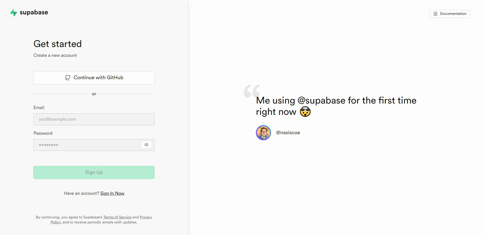

Сервис предоставляет два варианта для регистрации:

1. Регистрация через GitHub

2. Регистрация через электронную почту (рекомендовано для новичков)

### 1. Регистрация через GitHub

Для регистрации с помощью GitHub необходимо перейти по выделенной ссылке и затем пройти авторизацию на сайте GitHub.

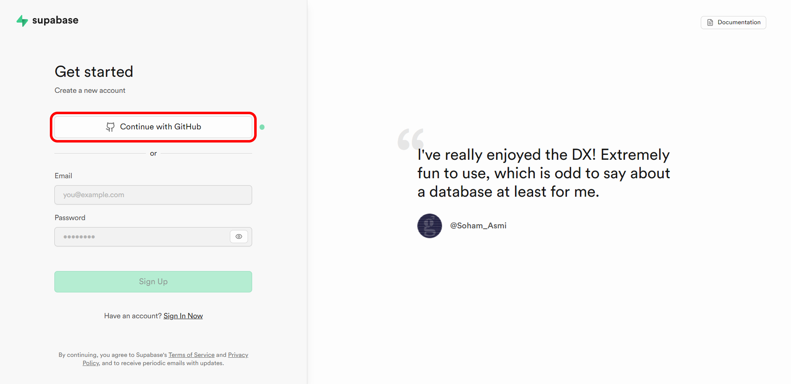

### 2. Регистрация через электронную почту

#### Шаг 1: Задание адреса электронной почты

Для регистрации через электронную почту сперва необходимо ввести актуальный адрес электронной почты в соответствующее поле для ввода.

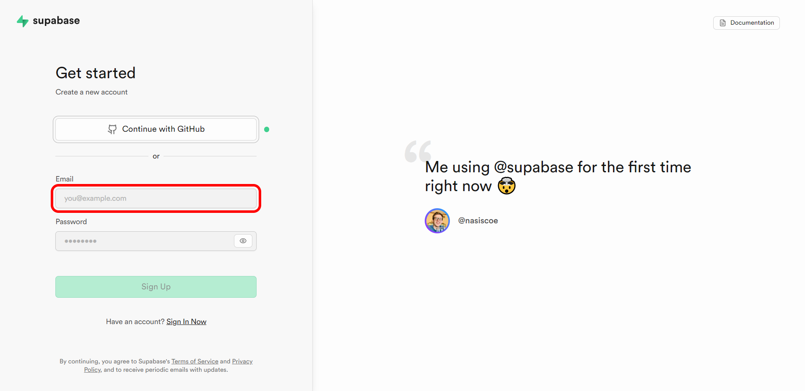

#### Шаг 2: Задание пароля

Далее в следующем поле необходимо ввести свой пароль.

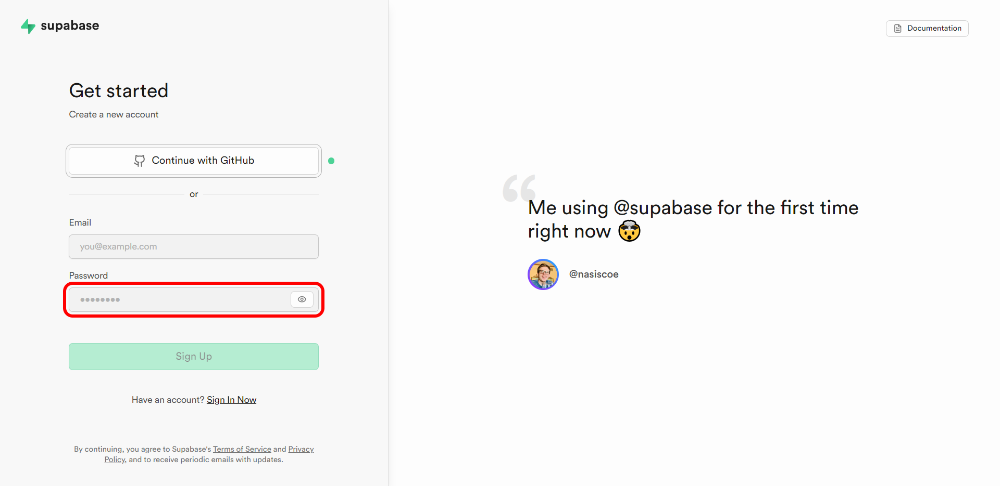

Необходимо, чтобы пароль содержал букву верхнего регистра, нижнего регистра, цифру, специальный символ и состоял как минимум из 8 символов.

#### Шаг 3: Кнопка "Зарегистрироваться"

Затем, для отправки формы необходимо нажать на кнопку "Sign Up".

#### Шаг 4: Подтверждение почты

После того, как кнопка Sign Up была нажата, следует проверить указанный адрес электронной почты и подтвердить регистрацию аккаунта, перейдя по ссылке во входящем письме. Ссылка для подтверждения действительна лишь в течение 10 минут.

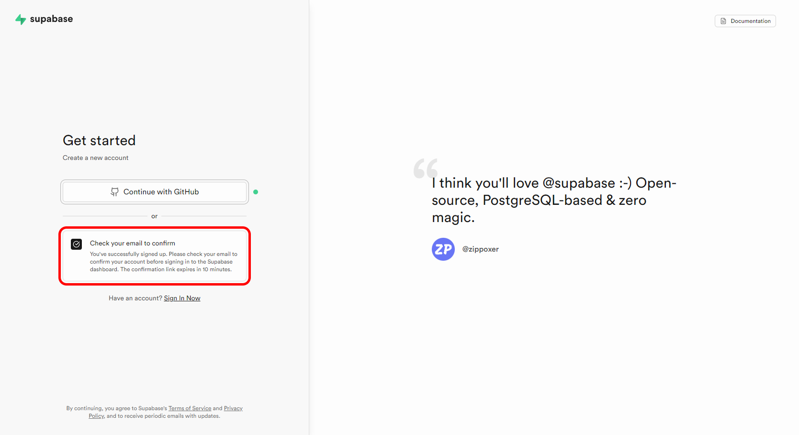

Перейдя в указанный при регистрации адрес электронной почты, необходимо открыть новое полученное письмо.

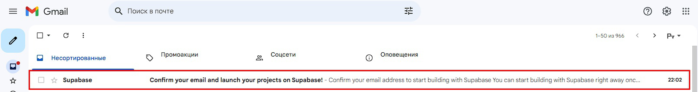

В открытом письме требуется перейти по ссылке, нажав на зелёную кнопку.

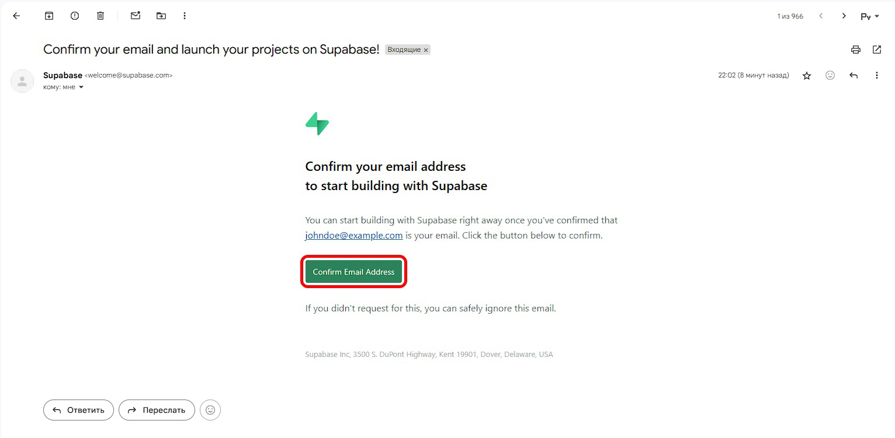

При нажатии на кнопку осуществится переход на страницу регистрации. Спустя несколько секунд, появится окно с предложением создать свою организацию.

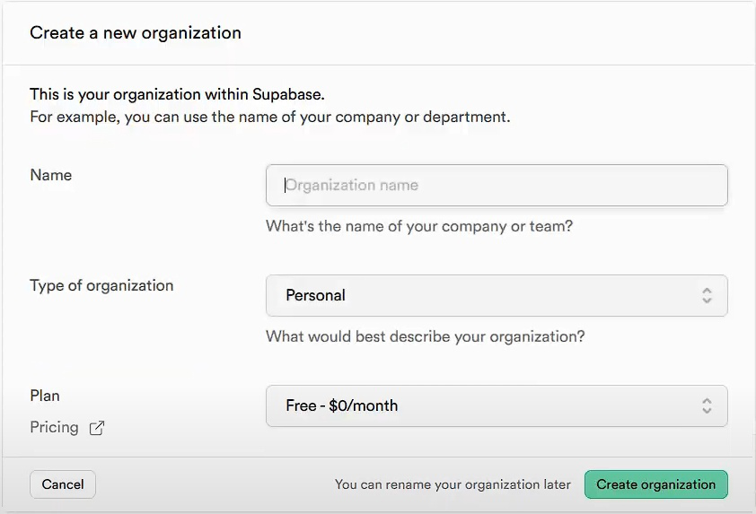

Узнать о том, как создать свою организацию и базу данных можно в следующем руководстве.

---

## Авторизация

Для того, чтобы войти в существующий аккаунт на сервисе Supabase необходимо перейти на [страницу авторизации](https://supabase.com/dashboard/sign-in?returnTo=%2Fprojects) и заполнить данные для входа.

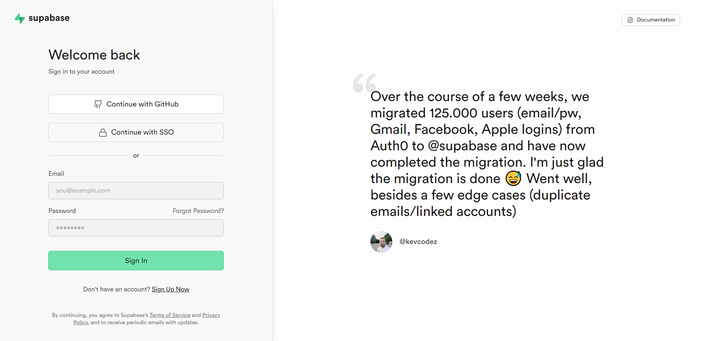

Сервис предоставляет три варианта для входа:

1. Авторизация через GitHub

2. Авторизация через технологию единого входа (SSO)

3. Авторизация через электронную почту (рекомендовано для новичков)

### 1. Авторизация через GitHub

Войти на сервис можно через GitHub, если аккаунт был ранее зарегистрирован с его помощью.

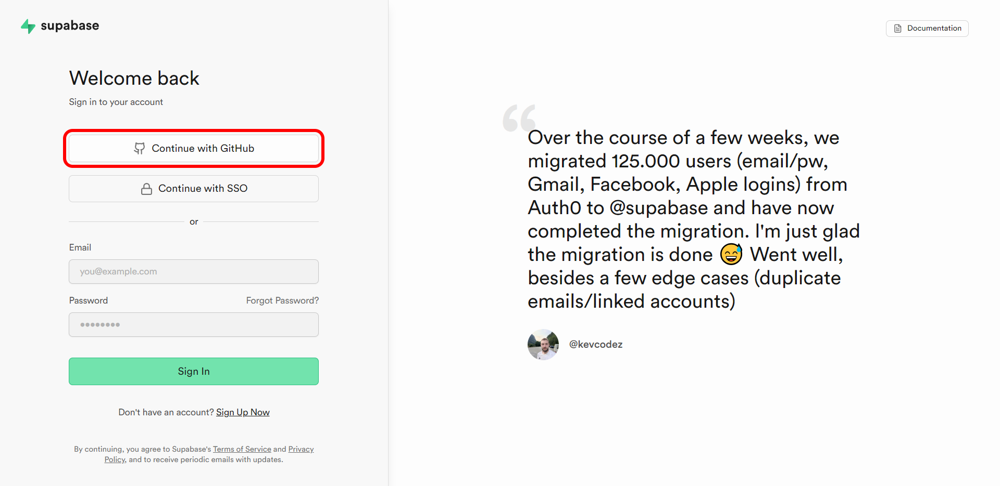

### 2. Авторизация через технологию единого входа (SSO)

Если сервис поддерживает вход через SSO (Single Sign-On), выберите соответствующую опцию.

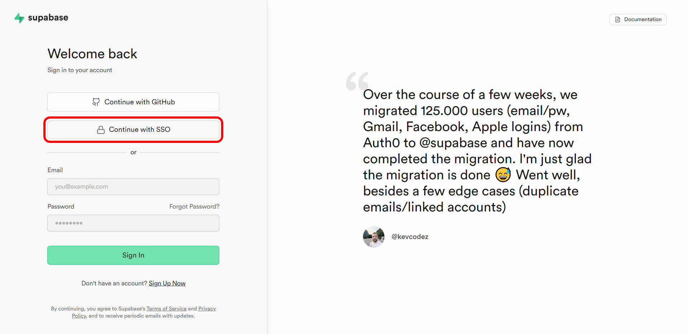

### 3. Авторизация через электронную почту

#### Шаг 1: Ввод электронной почты

Для входа через электронную почту сперва необходимо ввести email, который был использован при регистрации.

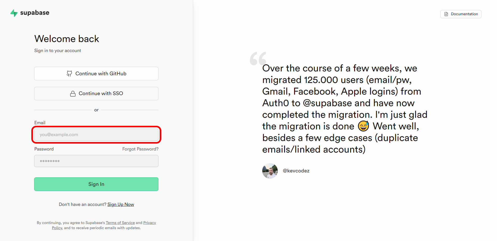

#### Шаг 2: Ввод пароля

Затем требуется ввести пароль, использованный при регистрации.

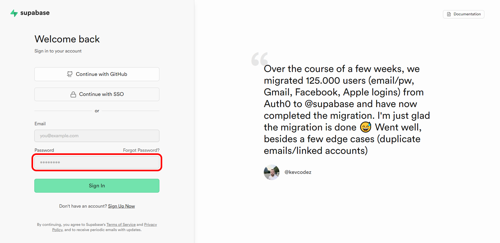

#### Шаг 3: Кнопка "Sign In"

Для завершения входа необходимо нажать на кнопку "Sign In".

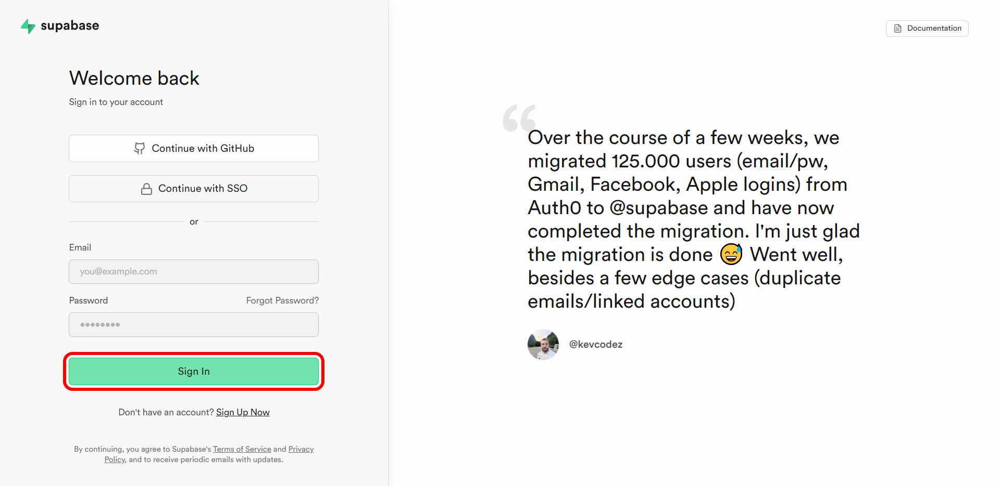

После нажатия кнопки "Sign In" будет осуществлён переход на главную страницу.

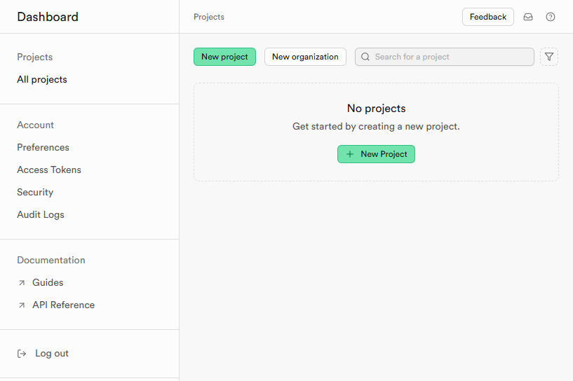

Узнать о том, как создать свою организацию и базу данных можно в следующем руководстве.
