# Руководство по простым запросам в SQL (PostgreSQL)

В этом руководстве рассмотрены основные запросы SELECT для работы с базой данных.

*В конце руководства представлен код заполнения таблиц для гарантированного выполнения запросов.*

---

## 1. Использование DISTINCT

Демонстрация модификатора `DISTINCT`:

```sql
SELECT DISTINCT "fullname"
FROM "Employee";
```

Этот запрос вернет уникальные значения поля "fullname" из таблицы "Employee".


**Выполнение запроса:**

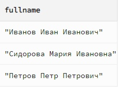

---

## 2. WHERE с простым условием

Ограничение вывода данных с помощью простого условия:

```sql
SELECT *
FROM "Product"
WHERE "measurement_unit" = 'штуки';
```

Запрос вернет все продукты, измеряемые в штуках.


**Выполнение запроса:**

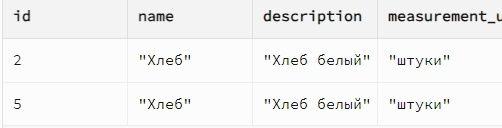

---

## 3. WHERE с составным условием

Ограничение вывода данных с использованием составного условия:

```sql
SELECT *
FROM "Product"
WHERE "measurement_unit" = 'литры' AND "name" LIKE 'М%';
```

Запрос вернет продукты, измеряемые в литрах, название которых начинается с буквы "М".


**Выполнение запроса:**

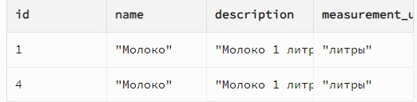


---

## 4. Функции IN, BETWEEN, LIKE, IS NULL

Демонстрация использования функций IN, BETWEEN, LIKE и IS NULL:

```sql
SELECT *
FROM "ProductCost"
WHERE "product_id" IN (1, 2) AND "cost" BETWEEN 50 AND 150 AND "date"::TEXT LIKE '2024-01%' AND "product_id" IS NOT NULL;
```

Запрос возвращает записи, где "product_id" равен 1 или 2, "cost" находится в пределах от 50 до 150, "date" начинается с "2024-01", и "product_id" не равен NULL.

**Выполнение запроса:**

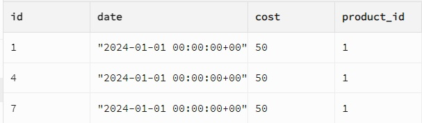

---

## 5. Использование NOT

Демонстрация условий с `NOT`:

```sql
SELECT *
FROM "Employee"
WHERE NOT "is_manager";
```

Запрос возвращает всех сотрудников, которые не являются менеджерами.

**Выполнение запроса:**

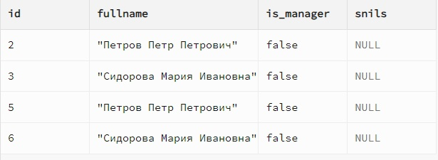

---

## 6. Агрегатные функции COUNT, SUM, AVG, MAX, MIN

Демонстрация использования агрегатной функции:

```sql
SELECT AVG("cost") AS "average_cost"
FROM "ProductCost";
```

Запрос возвращает среднюю стоимость продуктов.

**Выполнение запроса:**

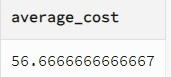

---

## 7. Использование COUNT(*)

Демонстрация использования `COUNT(*)`:

```sql
SELECT COUNT(*) AS "total_products"
FROM "Product";
```

Запрос возвращает общее количество продуктов.

**Выполнение запроса:**

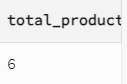

---

## 8. Простые вычисления в запросе

Выполним вычисления внутри SELECT:

```sql
SELECT "cost" * 1.2 AS "cost_with_tax"
FROM "ProductCost";
```

Запрос возвращает стоимость продуктов с учётом 20% налога.

**Выполнение запроса:**

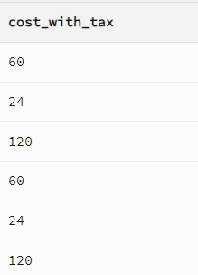

---

## 9. Вычисления как параметр агрегатной функции

Используем вычисления внутри агрегатной функции:

```sql
SELECT SUM("cost" * 0.9) AS "total_discounted_cost"
FROM "ProductCost";
```

Запрос возвращает суммарную стоимость продуктов с учетом 10% скидки.

**Выполнение запроса:**

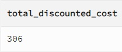

---

## 10. Использование GROUP BY

Группировка данных по полю:

```sql
SELECT "measurement_unit", COUNT(*) AS "unit_count"
FROM "Product"
GROUP BY "measurement_unit";
```

Запрос возвращает количество продуктов для каждой единицы измерения.

**Выполнение запроса:**

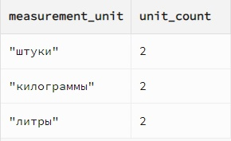

---

## 11. Использование HAVING

Фильтрация сгруппированных данных с помощью HAVING:

```sql
SELECT "product_id", AVG("cost") AS "average_cost"
FROM "ProductCost"
GROUP BY "product_id"
HAVING AVG("cost") > 50;
```

Запрос возвращает идентификаторы продуктов, для которых средняя стоимость продуктов превышает 50.

**Выполнение запроса:**

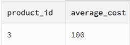

---

## Заполнение данными

Для успешного выполнения запросов таблицы базы данных должны быть заполнены следующим образом:

### Таблица "Employee"
```sql
INSERT INTO "Employee" ("fullname", "is_manager")
VALUES
  ('Иванов Иван Иванович', TRUE),
  ('Петров Петр Петрович', FALSE),
  ('Сидорова Мария Ивановна', FALSE);
```

### Таблица "Storage"
```sql
INSERT INTO "Storage" ("number", "address", "phone")
VALUES
  (1, 'ул. Ленина, д. 1', '123-456-7890'),
  (2, 'ул. Гагарина, д. 5', '987-654-3210');
```

### Таблица "Product"
```sql
INSERT INTO "Product" ("name", "description", "measurement_unit")
VALUES
  ('Молоко', 'Молоко 1 литр', 'литры'),
  ('Хлеб', 'Хлеб белый', 'штуки'),
  ('Яблоки', 'Яблоки зеленые', 'килограммы');
```

### Таблица "ProductCost"
```sql
INSERT INTO "ProductCost" ("date", "cost", "product_id")
VALUES
  ('2024-01-01', 50.00, 1),
  ('2024-01-02', 20.00, 2),
  ('2024-01-03', 100.00, 3);
```

### Таблица "Operation"
```sql
INSERT INTO "Operation" ("date", "type", "storage_id", "employee_id")
VALUES
  ('2024-01-01', 'поступление', 1, 1),
  ('2024-01-02', 'списание', 2, 2);
```

### Таблица "ProductOperation"
```sql
INSERT INTO "ProductOperation" ("count", "product_id", "operation_id")
VALUES
  (100, 1, 1),
  (50, 2, 2);
```

### Таблица "Work"
```sql
INSERT INTO "Work" ("storage_id", "employee_id", "date_start", "date_end", "wage_rate")
VALUES
  (1, 1, '2024-01-01', NULL, 5000.00),
  (2, 2, '2024-01-02', NULL, 4500.00);
```

---

## Заключение

Теперь вы знаете, как выполнять простые запросы SELECT в PostgreSQL, а также как заполнять данные для успешного тестирования запросов. Используйте эти примеры для анализа и работы с вашей базой данных.

