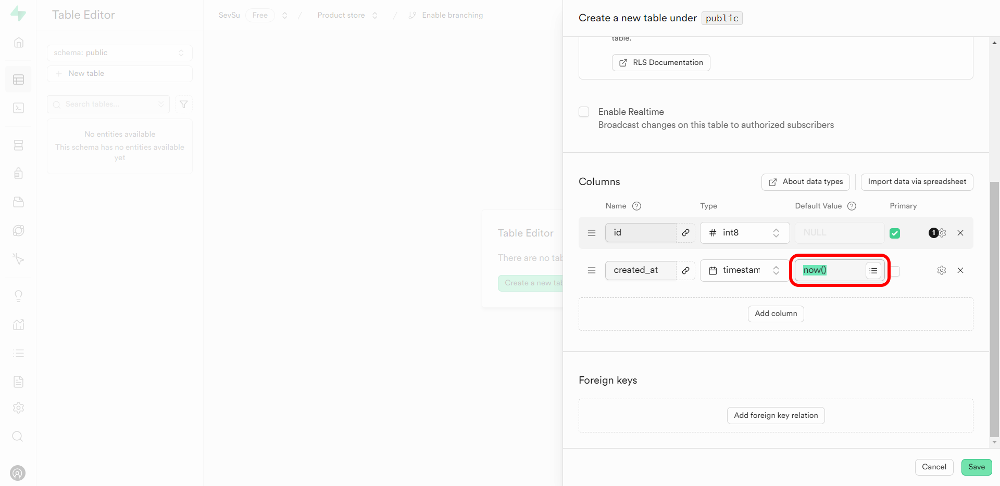

// TODO: Шаг 3.6; Шаг 4 (полностью); Шаг 5 (полностью); Шаг 7 (картинка)

# Руководство по созданию таблицы в Supabase с использованием Table Editor

В этом руководстве мы рассмотрим шаги по созданию таблиц проекта в сервисе Supabase. Будет рассмотрено два метода: используя Table Editor и используя SQL Editor.

Для начала работы с таблицами необходимо войти в свой проект. Если вы находитесь на [главной странице проектов](https://supabase.com/dashboard/projects), требуется кликнуть по кнопке с названием созданного ранее проекта.

   

После перехода по ссылке вы попадёте на главную страницу проекта.

---

## 1. Table Editor

### Шаг 1: Открытие Table Editor

Для того, чтобы воспользоваться редактором таблиц **Table Editor**, необходимо кликнуть на кнопку с соответствующим названием.

   

### Шаг 2: Начало создания новой таблицы

1. Перейдя в **Table Editor** следует нажать на кнопку **Create a new table** для создания новой таблицы.
   
2. При нажатии открывается интерфейс для настройки таблицы, где можно указать её имя и настроить столбцы.
   

### Шаг 3: Указание имени таблицы и базовых настроек

1. В поле **Name** введите название новой таблицы. Например, **Products**.

   

2. В поле **Description** можно добавить краткое описание таблицы, чтобы пояснить её назначение. Это может помочь в организации и понимании структуры данных.

   

3. Сервис Supabase по умолчанию предлагает включить **Row Level Security (RLS)** — настройку безопасности на уровне строк для защиты данных и настройки доступа. Вы можете ознакомиться с документацией по RLS, перейдя по выделенной [ссылке](https://supabase.com/docs/guides/auth/row-level-security) (источник на английском языке).

   

4. Если вам необходимо, чтобы таблица поддерживала обновление данных в реальном времени, поставьте галочку возле опции **Enable Realtime**. По умолчанию эта опция отключена.

   

5. Для того, чтобы узнать подробнее про работу с типами данных в PostgreSQL, вы можете перейти по выделенной [ссылке](https://supabase.com/docs/guides/database/tables#data-types) (источник на английском языке).

   

6. **Import data via spreadsheet** — импортируйте данные для таблицы (например, CSV-файл), если необходимо предварительно заполнить таблицу данными.

   

### Шаг 4: Добавление столбцов

1. Перейдите к добавлению столбцов с помощью опции **Add Column**.
   
2. Для каждого столбца:
   - Укажите **Name** (например, "product_name").
   - Выберите **Type** из предложенного списка (например, `text` или `integer`).
   
   - Укажите значения по умолчанию, если это необходимо.
   - Вы можете установить столбец как **Primary Key** или добавить внешние связи.

### Шаг 5: Настройка значений по умолчанию и дополнительных опций

1. В интерфейсе каждого столбца доступны дополнительные параметры, например, **Default Value** и **Foreign Key Relation**.
2. Настройте параметры, такие как значение по умолчанию или дополнительные атрибуты, если требуется.

   
   

### Шаг 6: Завершение создания таблицы

1. После заполнения всех необходимых данных и параметров для создания таблицы, вы увидите готовую таблицу к сохранению:

   
   

2. Если хотите отменить создание таблицы, используйте опцию отмены **Cancel**.

   

3. Убедитесь, что все столбцы добавлены, и параметры настроены. После завершения всех настроек нажмите **Save**, чтобы создать таблицу.

   

### Шаг 7: Просмотр и работа с новой таблицей

После сохранения таблица будет доступна для работы в **Table Editor** и других разделах Supabase, таких как **SQL Editor** для выполнения запросов.

   

---

## 2. SQL Editor

### Шаг 1: Открытие SQL Editor

---

## Заключение

Теперь таблица успешно создана и готова к использованию. Вы можете добавлять данные, выполнять запросы и настраивать связи между таблицами, используя возможности Supabase.
