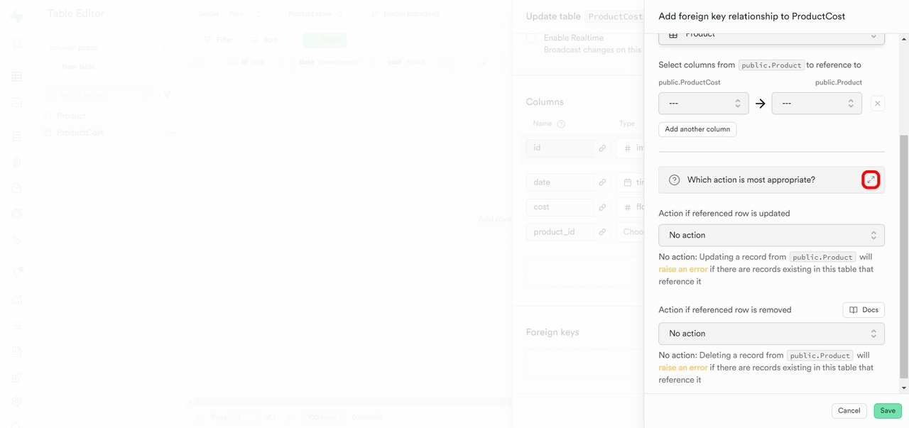
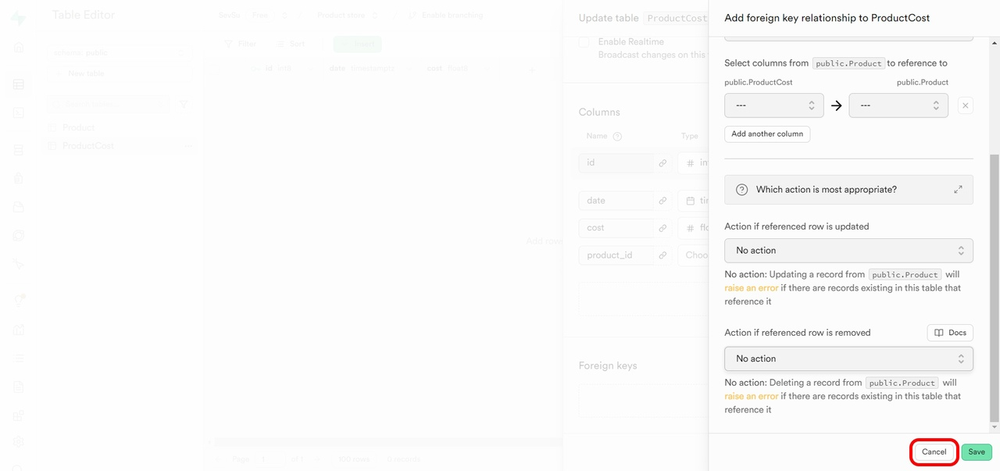

// TODO: Шаг 3.6 (забить или нет?); Шаг 4 (вроде есть?); Шаг 5 (вроде сделан??); 
// Шаг 7 (картинка)

# Руководство по созданию таблиц в Supabase с использованием Table Editor и SQL Editor

В этом руководстве мы рассмотрим шаги по созданию таблиц проекта в сервисе Supabase. Будет рассмотрено два метода: используя Table Editor и используя SQL Editor.

Для начала работы с таблицами необходимо войти в свой проект. Если вы находитесь на [главной странице проектов](https://supabase.com/dashboard/projects), требуется кликнуть по кнопке с названием созданного ранее проекта.

   

После перехода по ссылке вы попадёте на главную страницу проекта.

---

## 1. Table Editor

### Шаг 1: Открытие Table Editor

Для того, чтобы воспользоваться редактором таблиц **Table Editor**, необходимо кликнуть на кнопку с соответствующим названием.

   

### Шаг 2: Начало создания новой таблицы

1. Перейдя в **Table Editor** следует нажать на кнопку **Create a new table** для создания новой таблицы.
   
2. При нажатии открывается интерфейс для настройки таблицы, где можно указать её имя и настроить столбцы.
   

### Шаг 3: Указание имени таблицы и базовых настроек

1. В поле **Name** введите название новой таблицы. Например, **Products**.

   

2. В поле **Description** можно добавить краткое описание таблицы, чтобы пояснить её назначение. Это может помочь в организации и понимании структуры данных.

   

3. Сервис Supabase по умолчанию предлагает включить **Row Level Security (RLS)** — настройку безопасности на уровне строк для защиты данных и настройки доступа. Вы можете ознакомиться с документацией по RLS, перейдя по выделенной [ссылке](https://supabase.com/docs/guides/auth/row-level-security) (источник на английском языке).

   

4. Рассылку изменений в этой таблице авторизованным пользователям можно настроить, поставив галочку возле опции **Enable Realtime**. Мы оставим это поле незаполненным.

   

5. Для того, чтобы узнать подробнее про работу с типами данных в PostgreSQL, вы можете перейти по выделенной [ссылке](https://supabase.com/docs/guides/database/tables#data-types) (источник на английском языке).

   

6. **Import data via spreadsheet** — импортируйте данные для таблицы (например, CSV-файл), если необходимо предварительно заполнить таблицу данными.

   

### Шаг 4: Добавление столбцов

1. В разделе **Columns** можно настроить столбцы таблицы. По умолчанию для каждой таблицы создаются столбцы `id` и `created_at` (время создания записи).

2. Для того, чтобы создать собственные столбцы, необходимо перейти к добавлению столбцов с помощью опции **Add Column**.
   
3. Для каждого столбца:
   - Укажите **Name** (например, "product_name").
   - Выберите **Type** из предложенного списка (например, `text` или `integer`).
   
   - Укажите значения, выставляемые у этого атрибута по умолчанию, если это необходимо.
  
   - Вы можете установить столбец как **Primary Key** или добавить внешние связи.


### Шаг 5: Настройка внешних ключей (Foreign keys)

   Если какое-нибудь поле вашей таблицы зависит от значений из другой таблицы, эту зависимость необходимо указать при помощи внешних ключей.
   Чтобы настроить внешний ключ таблицы, требуется перейти в раздел **Foreign keys** и нажать на кнопку **Add foreign key relation**.

   

   Далее открывается окно настройки внешнего ключа в таблице ProductCost. При нажатии на иконку с двумя диагональными стрелками, раскрывается ссылка на [документацию](https://www.postgresql.org/docs/current/tutorial-fk.html) по внешним ключам.

   

   

 Далее следует убедиться, что выбрана правильная схема базы данных (в нашем случае **public**)


Затем необходимо выбрать таблицу, на которую будут ссылаться выбранные столбцы. В нашем примере выбираем таблицу Product.


После выбора таблицы необходимо назначить зависимый столбец (поле слева) и основной столбец (поле справа). 


Если вы хотите удалить внешний ключ, нажмите на иконку крестика.


Если требуется добавить ещё один внешний клююч, нажмите **Add another column**.


Создание внешнего ключа образует связь между столбцами из разных таблиц. Наличие связи, в свою очередь, требует описания действий таблиц при удалении и обновлении записей. Больше информации о действиях можете узнать, перейдя [по ссылке](https://www.postgresql.org/docs/current/ddl-constraints.html#DDL-CONSTRAINTS-FK).




В следующем поле мы выбираем действие, которое будет выполняться при обновлении записи в таблице. По умолчанию выставлено значение No action (отсутствие действия).


Далее мы выбираем действие, которое будет выполняться при удалении записи в таблице. По умолчанию также выставлено значение No action (отсутствие действия).


При раскрытии меню с действиями можно увидеть их полный список: **Cascade** (каскадирование), **Restrict** (предотвращение), set **default** (задать значение по умолчанию), **set NULL** (задать значение NULL).


Чаще всего, при установке внешнего ключа выбирается действие каскадирования. Более подробно про каскадирование таблиц можно узнать, перейдя [по ссылке на документацию](https://supabase.com/docs/guides/database/postgres/cascade-deletes).


Полностью заполненная форма создания внешнего ключа между таблицами Product и ProductCost представлена на скринах ниже:


Если Вы хотите отменить изменения, нажмите **Cancel**.



Для сохранения всех изменений, нажмите **Save**.


### Шаг 6: Завершение создания таблиц

1. После заполнения всех необходимых данных и параметров для создания таблицы, вы увидите готовую таблицу к сохранению:

```text
Name: Product
Description: Тип продуктов
```

   
   
2. Если хотите отменить создание таблицы, используйте опцию отмены **Cancel**.

   
3. Убедитесь, что все столбцы добавлены, и параметры настроены. После завершения всех настроек нажмите **Save**, чтобы создать таблицу.

   

### Шаг 7: Просмотр и работа с новой таблицей

После сохранения таблица будет доступна для работы в **Table Editor** и других разделах Supabase, таких как **SQL Editor** для выполнения запросов.

   


---

## 2. SQL Editor

### Шаг 1: Открытие SQL Editor

---

## Заключение

Теперь таблица успешно создана и готова к использованию. Вы можете добавлять данные, выполнять запросы и настраивать связи между таблицами, используя возможности Supabase.
